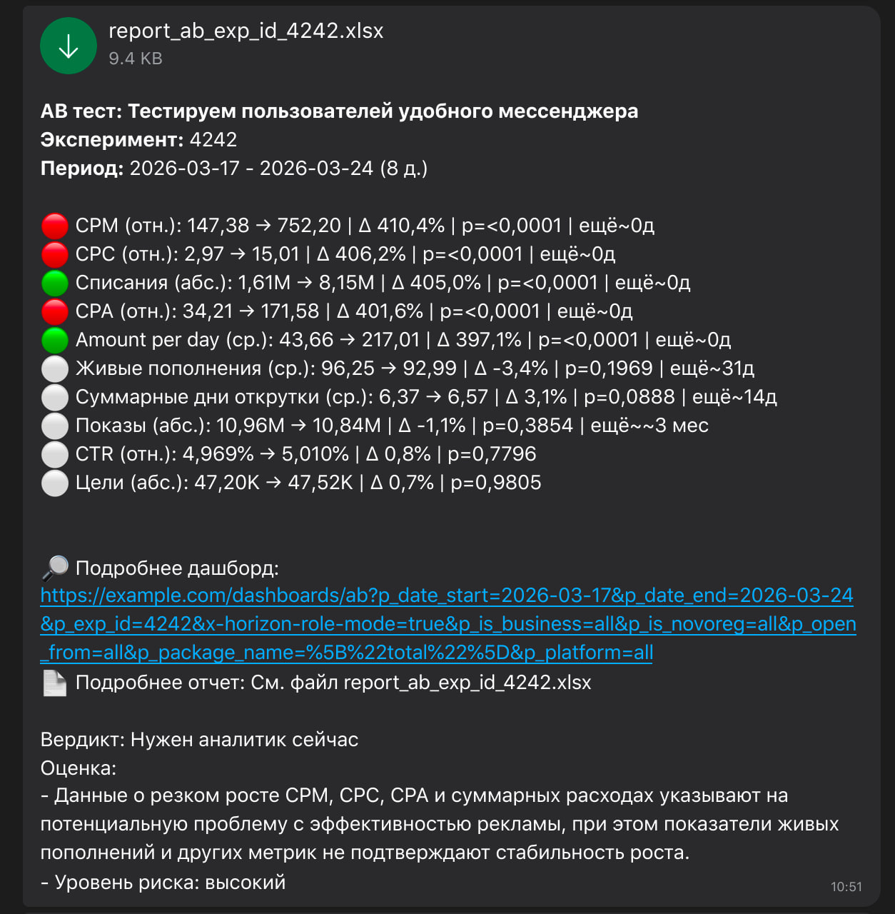
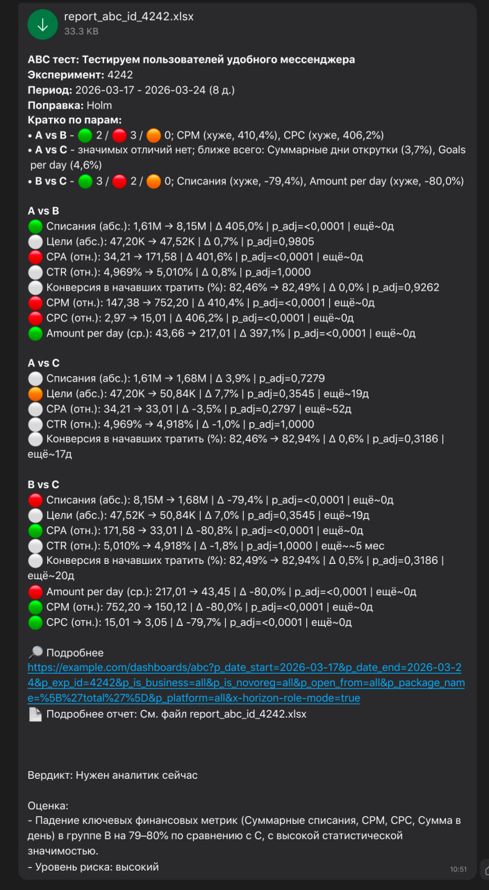

# fast_exp_analytics


Fast experiment analytics toolkit for A/B and A/B/C tests, MDE estimation, experiment duration planning, reporting, and chat-ready summaries

`fast_exp_analytics` is a Python library for analysts and product teams who need to quickly analyze online experiments, calculate experiment metrics, prepare readable summaries, export results to Excel, and estimate the required duration of future tests

The library is designed for practical analytics workflows in Jupyter Notebook: prepare data, describe metrics in a simple config, run A/B or A/B/C analysis, generate a styled table, export the result, and prepare a short message for stakeholders

---

## Examples

### Chat-ready experiment summaries

<table align="center">
  <tr>
    <td align="center">
      
      <br>
      <sub>A/B test summary</sub>
    </td>
    <td align="center">
      
      <br>
      <sub>A/B/C test summary</sub>
    </td>
  </tr>
</table>

### Included example notebook and reports

The repository contains a full example notebook and several generated report examples:

| File | Description |
|---|---|
| [`examples/fast_exp_analytics_example.ipynb`](examples/fast_exp_analytics_example.ipynb) | Full notebook with the main workflow: A/B analysis, A/B/C analysis, chat messages, Excel export, MDE and duration planning |
| [`examples/report_ab_exp_id_4242.xlsx`](examples/report_ab_exp_id_4242.xlsx) | Example Excel report for an A/B test |
| [`examples/report_abc_id_4242.xlsx`](examples/report_abc_id_4242.xlsx) | Example Excel report for an A/B/C test |
| [`examples/duration_plan_ab.xlsx`](examples/duration_plan_ab.xlsx) | Example duration planning report |
| [`examples/duration_plan_ab_custom.xlsx`](examples/duration_plan_ab_custom.xlsx) | Example custom duration planning report |

---

## What the library does

`fast_exp_analytics` helps with three main tasks:

### 1. Experiment result analysis

- A/B test analysis
- A/B/C test analysis
- Comparison of control and test groups
- Calculation of absolute and relative metric changes
- Statistical significance checks
- Multiple-comparison correction for A/B/C tests

### 2. Experiment reporting

- Styled result tables for notebooks
- Short summaries for chats and task comments
- Excel export with experiment results
- Optional LLM-based review of experiment results
- Optional message sending with an attached report

### 3. Experiment planning

- MDE estimation for different experiment durations
- Required number of days for target MDE
- Planning for A/B and A/B/C experiments
- Support for different rollout shares
- Aggregation of historical data to experiment-unit level

---

## Main use cases

Use `fast_exp_analytics` when you need to:

- quickly calculate A/B test results
- compare several experiment groups in an A/B/C test
- prepare a short experiment summary for a manager, product owner, or team chat
- export experiment results to Excel
- estimate whether the experiment has enough sensitivity
- calculate MDE for 7, 14, 21, 28 or more days
- estimate how many days are needed to detect a target effect
- reuse the same experiment analysis logic across notebooks and projects

---

## Installation

### From PyPI

```bash
pip install fast-exp-analytics
```

### From GitHub

```bash
pip install git+https://github.com/your-username/fast_exp_analytics.git
```

### For local development

```bash
git clone https://github.com/your-username/fast_exp_analytics.git
cd fast_exp_analytics

python -m venv venv
source venv/bin/activate

pip install -e ".[dev]"
```

---

## Quick start

A full usage example is available in the notebook:

```text
examples/fast_exp_analytics_example.ipynb
```

The notebook shows the main workflow:

- loading or generating experiment data
- configuring metrics
- running A/B analysis
- running A/B/C analysis
- styling result tables
- building dashboard URLs
- generating chat messages
- adding optional LLM review
- exporting reports to Excel
- planning experiment duration and MDE

---

## Basic workflow

```python
import pandas as pd

from fast_exp_analytics import (
    run_ab_test,
    style_table_ab,
    build_ab_chat_message,
    export_ab_results_to_excel,
)
```

### 1. Prepare experiment data

The input data should usually be aggregated at the experiment unit level

Example:

| user_id | exp_group | shows | clicks | amount | goals | is_create_ad |
|--------:|-----------|------:|-------:|-------:|------:|-------------:|
| 1001    | A         | 1200  | 54     | 320.5  | 7     | 1            |
| 1002    | B         | 980   | 41     | 210.0  | 3     | 0            |
| 1003    | A         | 1500  | 73     | 460.7  | 9     | 1            |

The library does not force a specific data source. Data can come from SQL, YQL, ClickHouse, CSV, Excel, pandas transformations, or any other pipeline

---

### 2. Describe metrics

Metrics are configured with a simple `pandas.DataFrame`

```python
metrics_df = pd.DataFrame.from_dict(
    {
        "shows": ["Shows", "additive", "shows", "shows", "positive"],
        "clicks": ["Clicks", "additive", "clicks", "clicks", "positive"],
        "amount": ["Amount", "additive", "amount", "amount", "positive"],
        "ctr": ["CTR", "ratio", "clicks", "shows", "positive"],
        "cpc": ["CPC", "ratio", "amount", "clicks", "negative"],
        "cpa": ["CPA", "ratio", "amount", "goals", "negative"],
        "cr_created": [
            "Created campaign conversion",
            "share",
            "is_create_ad",
            "is_in_exp",
            "positive",
        ],
    },
    orient="index",
    columns=["desc", "type", "num", "den", "direction"],
)
```

Metric config columns:

| Column | Meaning |
|---|---|
| `desc` | Human-readable metric name |
| `type` | Metric type: `additive`, `average`, `ratio`, `share` |
| `num` | Numerator or value column |
| `den` | Denominator column |
| `direction` | Direction of improvement: `positive` or `negative` |

---

### 3. Run A/B test

```python
df_result_ab = run_ab_test(
    df=df,
    metrics_df=metrics_df,
    exp_start_date="2026-03-17",
    exp_end_date="2026-03-24",
    group_base="A",
    group_exp="B",
    alpha=0.05,
    power=0.80,
)
```

---

### 4. Display result table

```python
style_table_ab(
    df_result_ab,
    comment="Experiment description",
    exp_start_date="2026-03-17",
    exp_end_date="2026-03-24",
    experiment_id=4242,
)
```

---

### 5. Export result to Excel

```python
excel_path = export_ab_results_to_excel(
    df_result_ab=df_result_ab,
    output_path="report_ab_exp_id_4242.xlsx",
    experiment_desc="Experiment description",
    exp_id=4242,
    date_from="2026-03-17",
    date_to="2026-03-24",
)
```

---

### 6. Build short message

```python
msg = build_ab_chat_message(
    df_result=df_result_ab,
    experiment_desc="Experiment description",
    exp_id=4242,
    date_from="2026-03-17",
    date_to="2026-03-24",
    dashboard_url="https://example.com/dashboard",
    max_metrics=10,
    show_days_more=True,
)

print(msg)
```

Example output:

```text
AB test: Experiment description
Experiment: 4242
Period: 2026-03-17 - 2026-03-24

🟢 Amount: 1.61M → 8.15M | Δ 405.0% | p=<0.0001
🔴 CPA: 34.21 → 171.58 | Δ 401.6% | p=<0.0001
⚪ CTR: 4.969% → 5.010% | Δ 0.8% | p=0.7796

Dashboard:
https://example.com/dashboard
```

---

## A/B/C analysis

For A/B/C experiments, use `run_abc_test`.

```python
from fast_exp_analytics import (
    run_abc_test,
    style_table_abc,
    build_abc_chat_message,
    export_abc_results_to_excel,
)

df_result_abc = run_abc_test(
    df=df,
    metrics_df=metrics_df,
    exp_start_date="2026-03-17",
    exp_end_date="2026-03-24",
    include_bc=True,
    alpha=0.05,
    power=0.80,
    pvalue_adjust_method="holm",
)
```

Prepare a styled table:

```python
style_table_abc(
    df_result_abc,
    caption="Experiment description: 2026-03-17 — 2026-03-24",
)
```

Generate a short summary:

```python
msg = build_abc_chat_message(
    df_result=df_result_abc,
    experiment_desc="Experiment description",
    exp_id=4242,
    date_from="2026-03-17",
    date_to="2026-03-24",
    dashboard_url="https://example.com/dashboard",
    alpha=0.05,
    p_adjust_method="Holm",
    use_adjusted=True,
)

print(msg)
```

Export the report:

```python
excel_path = export_abc_results_to_excel(
    df_result_abc=df_result_abc,
    output_path="report_abc_id_4242.xlsx",
    experiment_desc="Experiment description",
    exp_id=4242,
    date_from="2026-03-17",
    date_to="2026-03-24",
)
```

---

## Experiment duration planning

The library can also help estimate experiment duration and MDE using historical data.

```python
from fast_exp_analytics import (
    build_experiment_level,
    default_duration_metrics_config,
    mde_table_for_experiment_duration,
    required_days_for_target_mde_table,
    export_duration_results_to_excel,
)
```

### Aggregate historical data to experiment-unit level

```python
agg_df = build_experiment_level(
    df_raw,
    unit_id_col="user_id",
    date_col="date",
    amount_col="amount",
    shows_col="shows",
    clicks_col="clicks",
    goals_col="main_goals",
    entity_id_col="campaign_id",
)
```

### Calculate MDE for different durations

```python
metrics_duration_df = default_duration_metrics_config()

mde_by_days = mde_table_for_experiment_duration(
    df_raw=df_raw,
    unit_id_col="user_id",
    rollout_pct=0.5,
    exp_days=[7, 14, 21, 28, 35],
    experiment_type="ab",
    metrics_config=metrics_duration_df,
    alpha=0.05,
    power=0.80,
    date_col="date",
    amount_col="amount",
    shows_col="shows",
    clicks_col="clicks",
    goals_col="main_goals",
    entity_id_col="campaign_id",
)
```

### Estimate required days for target MDE

```python
days_for_target_mde = required_days_for_target_mde_table(
    df_raw=df_raw,
    unit_id_col="user_id",
    rollout_pct=0.5,
    target_mde_pct=[5, 7, 10],
    experiment_type="ab",
    metrics_config=metrics_duration_df,
    alpha=0.05,
    power=0.80,
    date_col="date",
    amount_col="amount",
    shows_col="shows",
    clicks_col="clicks",
    goals_col="main_goals",
    entity_id_col="campaign_id",
)
```

### Export planning result

```python
excel_path = export_duration_results_to_excel(
    output_path="duration_plan_ab.xlsx",
    mde_by_days_df=mde_by_days,
    days_for_target_mde_df=days_for_target_mde,
    experiment_name="Experiment name",
    experiment_type="ab",
    rollout_pct=50,
    recommended_days=21,
    comment="The estimate is based on historical data at user_id level.",
)
```

---

## Core functions

The main public functions are grouped by workflow

### A/B tests

| Function | Purpose |
|---|---|
| `run_ab_test` | Runs A/B test analysis |
| `style_table_ab` | Builds a styled result table for notebooks |
| `build_ab_chat_message` | Generates a short text summary |
| `build_dashboard_url_ab` | Builds a dashboard URL with parameters |
| `export_ab_results_to_excel` | Exports A/B results to Excel |

### A/B/C tests

| Function | Purpose |
|---|---|
| `run_abc_test` | Runs A/B/C or multi-group analysis |
| `style_table_abc` | Builds a styled result table for notebooks |
| `build_abc_chat_message` | Generates a short text summary |
| `build_dashboard_url_abc` | Builds a dashboard URL with parameters |
| `export_abc_results_to_excel` | Exports A/B/C results to Excel |

### Duration planning

| Function | Purpose |
|---|---|
| `build_experiment_level` | Aggregates raw historical data to experiment-unit level |
| `units_per_day_from_raw` | Estimates available units per day from raw data |
| `default_duration_metrics_config` | Returns default metrics for duration planning |
| `mde_table_for_experiment_duration` | Calculates MDE for different experiment durations |
| `required_days_for_target_mde_table` | Estimates required days for target MDE |
| `duration_plan_summary` | Builds a full duration planning summary |
| `export_duration_results_to_excel` | Exports duration planning results to Excel |

### Optional integrations

| Function / Config | Purpose |
|---|---|
| `OpenAICompatConfig` | Config for OpenAI-compatible LLM API |
| `build_llm_review` | Generates optional LLM review of experiment results |
| `ChatSendConfig` | Config for chat/message API|
| `send_chat_message` | Sends message and optional file to chat |

---

## Supported metric types

| Type | Description | Examples |
|---|---|---|
| `additive` | Sum-based metrics. | revenue, amount, clicks, shows, goals |
| `average` | Average value per unit. | average amount per user, campaign days |
| `ratio` | Numerator divided by denominator. | CTR, CPC, CPA, CPM |
| `share` | Share/conversion metrics. | conversion to action, payer share |

---

## Project structure

```text
fast_exp_analytics/
├── fast_exp_analytics/
├── examples/
├── tests/
├── README.md
├── CHANGELOG.md
├── pyproject.toml
├── MANIFEST.in
└── Makefile
```

---

## License

MIT © 2026 Alexey Voronko