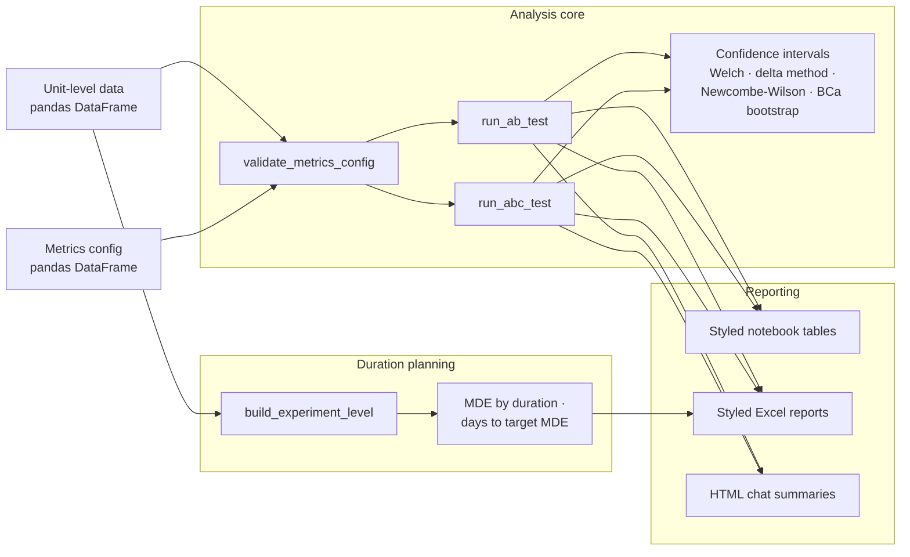

English | [Русский](README_RU.md)

# fast_exp_analytics

**A Python toolkit for A/B and A/B/C experiment analysis: statistics, confidence intervals, MDE and duration planning, Excel reports, and chat-ready summaries — designed around analyst workflows in Jupyter.**

<p align="center">
  <a href="https://pypi.org/project/fast-exp-analytics/"></a>
  
  <a href="https://github.com/klipbn/fast_exp_analytics/actions/workflows/ci.yml"></a>
  <a href="https://github.com/klipbn/fast_exp_analytics/blob/main/LICENSE"></a>
  
</p>

## Overview

Product analysts routinely repeat the same experiment loop: pull unit-level data, decide how each metric is computed, run significance tests, build a report, and write a summary for stakeholders. Most teams end up with a pile of one-off notebooks where every test is calculated slightly differently.

`fast_exp_analytics` turns that loop into a small, consistent pipeline:

1. Bring your own data — any unit-level `pandas.DataFrame` (SQL, ClickHouse, CSV — ingestion stays outside the library).
2. Describe metrics once in a config `DataFrame`: name, type (`additive` / `average` / `ratio` / `share` / `median`), numerator, denominator, and which direction counts as an improvement.
3. Run an A/B or A/B/C analysis and get p-values, confidence intervals, MDE, achieved power, and projected experiment duration for every metric.
4. Render a styled notebook table, export a formatted Excel report, and generate a short HTML summary for a team chat.

The same metric config drives all of it — statistics, tables, exports, and chat messages — so results are computed the same way every time.

## Features

- **Five metric types with statistics matched to each** — Welch's t-test for additive/average metrics, linearization for ratio metrics (CTR, CPA, CPM), a two-proportion z-test for shares, Mann–Whitney U for medians.
- **Confidence intervals for every metric type** — Welch t-interval, delta method for ratios, Newcombe–Wilson for shares (correct at 0%/100%), reproducible BCa bootstrap for medians.
- **A/B/C support out of the box** — all pairwise comparisons with Holm p-value correction and simultaneous (Bonferroni) confidence intervals.
- **Decision-oriented output per metric** — MDE, achieved power, required sample size, and an estimate of how many more days the test needs to reach significance.
- **Experiment duration planning** — aggregate raw daily history to any unit level, then estimate MDE for 7/14/21/28+ day runs or the number of days required for a target MDE, including unequal group splits and A/B vs A/B/C sensitivity.
- **Presentation built in** — styled notebook tables, multi-sheet Excel reports with conditional formatting, HTML chat summaries with sign icons and key-metric prioritization.
- **Optional integrations, no hard-coded infrastructure** — send results to a chat and enrich them with an LLM review via explicit config objects (OpenAI-compatible API).
- **Typed, tested, and linted** — `py.typed`, a pytest suite covering the statistics end-to-end, ruff-clean, CI on Python 3.10–3.12.

## Demo

Chat-ready experiment summaries (rendered from the HTML the library produces):

<table align="center">
  <tr>
    <td align="center">
      
      <br><sub>A/B test summary</sub>
    </td>
    <td align="center">
      
      <br><sub>A/B/C test summary</sub>
    </td>
  </tr>
</table>

The repository also ships a full example notebook and generated report files:

| File | Description |
|---|---|
| [`examples/fast_exp_analytics_example.ipynb`](examples/fast_exp_analytics_example.ipynb) | End-to-end workflow: A/B, A/B/C, chat messages, Excel export, MDE and duration planning |
| [`examples/report_ab_exp_id_4242.xlsx`](examples/report_ab_exp_id_4242.xlsx) | Example A/B Excel report |
| [`examples/report_abc_id_4242.xlsx`](examples/report_abc_id_4242.xlsx) | Example A/B/C Excel report |
| [`examples/duration_plan_ab.xlsx`](examples/duration_plan_ab.xlsx) | Example duration planning report |

## Installation

```bash
pip install fast-exp-analytics
```

From source:

```bash
git clone https://github.com/klipbn/fast_exp_analytics.git
cd fast_exp_analytics
python -m venv .venv && source .venv/bin/activate
pip install -e .
```

For development (tests, lint, notebook tooling):

```bash
pip install -e ".[dev]"
```

## Quick start

A complete run-through with synthetic data — this exact code executes end-to-end:

```python
import pandas as pd
from fast_exp_analytics import make_synthetic_abc_dataset, run_ab_test, style_table_ab

# 1. Unit-level experiment data (synthetic here; use your SQL/CSV pipeline in practice)
df = make_synthetic_abc_dataset(n=100_000, seed=42)
df_ab = df[df["exp_group"] != "C"]

# 2. Describe the metrics to compare
metrics_df = pd.DataFrame.from_dict(
    {
        "shows":  ["Shows", "additive", "shows",  "shows",  "positive"],
        "ctr":    ["CTR",   "ratio",    "clicks", "shows",  "positive"],
        "amount": ["Amount", "additive", "amount", "amount", "positive"],
        "cpa":    ["CPA",   "ratio",    "amount", "goals",  "negative"],
        "cr":     ["CR to campaign creation", "share", "is_create_ad", "is_in_exp", "positive"],
    },
    orient="index",
    columns=["desc", "type", "num", "den", "direction"],
)

# 3. Run the test
result = run_ab_test(
    df=df_ab,
    metrics_df=metrics_df,
    exp_start_date="2026-03-17",
    exp_end_date="2026-03-24",
    group_base="A",
    group_exp="B",
)

# 4. Inspect the styled table in a notebook
style_table_ab(result, comment="Demo experiment", experiment_id=4242)
```

## Usage

### A/B tests

```python
from fast_exp_analytics import (
    build_ab_chat_message,
    build_dashboard_url_ab,
    export_ab_results_to_excel,
)

# Styled Excel report
export_ab_results_to_excel(
    df_result_ab=result,
    output_path="report_ab.xlsx",
    experiment_desc="Demo experiment",
    exp_id=4242,
    date_from="2026-03-17",
    date_to="2026-03-24",
)

# Short HTML summary for a team chat
msg = build_ab_chat_message(
    df_result=result,
    experiment_desc="Demo experiment",
    exp_id=4242,
    date_from="2026-03-17",
    date_to="2026-03-24",
    dashboard_url="https://example.com/dashboard",
)
print(msg)
```

Input contract: the `df` passed to `run_ab_test` must contain `user_id`, `exp_group`, and every `num`/`den` column referenced by `metrics_df`. Missing columns raise a descriptive `ValueError`.

<details>
<summary><strong>A/B/C tests (multi-group)</strong></summary>

```python
from fast_exp_analytics import (
    build_abc_chat_message,
    export_abc_results_to_excel,
    run_abc_test,
    style_table_abc,
)

result_abc = run_abc_test(
    df=df,
    metrics_df=metrics_df,
    exp_start_date="2026-03-17",
    exp_end_date="2026-03-24",
    include_bc=True,                  # also compare B vs C
    pvalue_adjust_method="holm",      # Holm correction per metric
)

style_table_abc(result_abc, caption="Demo experiment: 2026-03-17 — 2026-03-24")

msg = build_abc_chat_message(
    df_result=result_abc,
    experiment_desc="Demo experiment",
    exp_id=4242,
    date_from="2026-03-17",
    date_to="2026-03-24",
    dashboard_url="https://example.com/dashboard",
    use_adjusted=True,
)

export_abc_results_to_excel(result_abc, "report_abc.xlsx")
```

Each metric is compared across all pairs (`A_vs_B`, `A_vs_C`, and optionally `B_vs_C`). P-values are Holm-corrected per metric, and confidence intervals are widened to simultaneous Bonferroni intervals across the compared pairs.

</details>

<details>
<summary><strong>Experiment duration planning (MDE)</strong></summary>

```python
from fast_exp_analytics import (
    build_experiment_level,
    default_duration_metrics_config,
    duration_plan_summary,
    export_duration_results_to_excel,
)

# Aggregate daily history to the experiment unit level
agg_df = build_experiment_level(
    df_raw,                 # daily rows: user_id, date, amount, shows, clicks, main_goals
    unit_id_col="user_id",
    entity_id_col="campaign_id",
)

# MDE achievable for different run lengths, and days needed for a target MDE
plan = duration_plan_summary(
    df_raw,
    unit_id_col="user_id",
    rollout_pct=0.5,                # share of traffic in the experiment
    exp_days=[7, 14, 21, 28, 35],
    target_mde_pct=[5, 7, 10],
    experiment_type="ab",           # or "abc"; supports unequal group_shares
    metrics_config=default_duration_metrics_config(),
)

export_duration_results_to_excel(
    output_path="duration_plan.xlsx",
    mde_by_days_df=plan["mde_by_days"],
    days_for_target_mde_df=plan["days_for_target_mde"],
    experiment_name="Budget recommendations",
    recommended_days=21,
)
```

The Excel report includes a manager-readable summary sheet alongside the raw tables. Custom metrics are added by extending the config with a `source_col` and an optional `log1p` transform.

</details>

<details>
<summary><strong>Optional integrations: chat delivery and LLM review</strong></summary>

```python
import os
from fast_exp_analytics import ChatSendConfig, OpenAICompatConfig, build_llm_review, send_chat_message

# Generic chat API (token passed explicitly, never hard-coded)
chat_config = ChatSendConfig(api_base_url="https://chat-api.example.com/bot/v1", token=os.environ["CHAT_BOT_TOKEN"])
send_chat_message(config=chat_config, message=msg, chat_id="my-chat-id", file_path="report_ab.xlsx")

# LLM review via any OpenAI-compatible endpoint
llm_config = OpenAICompatConfig(
    api_key=os.environ["OPENAI_API_KEY"],
    base_url="https://api.openai.com/v1",
    model="gpt-4o-mini",
)
review = build_llm_review(config=llm_config, system_prompt="You are an A/B test analyst.", user_prompt=msg)
```

Both integrations require their packages/credentials to be provided by the caller; the library core has no network dependencies beyond `requests` and takes no action on its own.

</details>

## Architecture


```mermaid
flowchart LR
    df["Unit-level data<br/>pandas DataFrame"]
    cfg["Metrics config<br/>pandas DataFrame"]

    subgraph core ["Analysis core"]
        val["validate_metrics_config"]
        ab["run_ab_test"]
        abc["run_abc_test"]
        ci["Confidence intervals<br/>Welch · delta method ·<br/>Newcombe-Wilson · BCa bootstrap"]
    end

    subgraph reporting ["Reporting"]
        table["Styled notebook tables"]
        excel["Styled Excel reports"]
        chat["HTML chat summaries"]
    end

    subgraph planning ["Duration planning"]
        agg["build_experiment_level"]
        mde["MDE by duration ·<br/>days to target MDE"]
    end

    df --> val
    cfg --> val
    val --> ab --> ci
    val --> abc --> ci
    ab --> table & excel & chat
    abc --> table & excel & chat
    df --> agg --> mde --> excel
```

- **`config.py`** — validates the metric config (allowed types, directions, unique names) and provides a default metric set.
- **`ab.py` / `abc.py`** — the statistical engine: per-metric-type preprocessing, tests, MDE/power/sample-size math, result tables. A/B/C adds pairwise comparisons and multiple-testing correction.
- **`confidence_intervals.py`** — one implementation of interval estimation shared by both engines.
- **`reporting*.py`** — pure formatting: notebook tables, dashboard URL builders, HTML chat messages with icon and key-metric logic.
- **`exporters*.py`** — Excel rendering (openpyxl): styled headers, number formats, conditional formatting, summary sheets.
- **`duration.py`** — history aggregation and MDE/duration estimates on top of the same z-statistics.
- **`llm.py` / `messaging.py`** — optional integrations, isolated behind explicit config objects.

## Statistical methods

| Metric type | Point estimate | Significance test | CI for the difference |
|---|---|---|---|
| `additive` | sum per group | Welch's t-test | Welch t-interval |
| `average` | mean per unit | Welch's t-test | Welch t-interval |
| `ratio` (CTR, CPA, …) | ratio of sums, linearized against control | Welch's t-test on linearized values | Delta method with influence functions |
| `share` | success share | Two-proportion z-test | Newcombe–Wilson (valid at 0% / 100%) |
| `median` | median per unit | Mann–Whitney U | BCa bootstrap (reproducible seed) |

MDE and sample-size estimates use the standard two-sample formula with the harmonic mean of group sizes; ratio MDE is expressed relative to the control denominator mean.

## Example output

`result` from the quick start (selected columns):

| metric_name | value_base | value_exp | rel_delta | p_value | result | ci_lower | ci_upper |
|---|---:|---:|---:|---:|---|---:|---:|
| Amount | 1 614 609 | 8 153 601 | +405.0% | <0.0001 | positive | 190.25 | 204.09 |
| CPA | 34.21 | 171.58 | +401.6% | <0.0001 | negative | 129.10 | 145.63 |
| CTR | 4.969% | 5.010% | +0.8% | 0.7796 | neutral | -0.0024 | 0.0032 |

`build_ab_chat_message` renders (HTML, shown as it appears in the chat client):

```text
🟢 Amount (абс.): 1,61M → 8,15M | Δ 405,0% | p=<0,0001
🔴 CPA (отн.): 34,21 → 171,58 | Δ 401,6% | p=<0,0001
⚪ CTR (отн.): 4,969% → 5,010% | Δ 0,8% | p=0,7796
```

Icons encode the verdict: 🟢 significant improvement, 🔴 significant degradation, 🟠 near-significant or a large observed effect, ⚪ neutral.

## Project structure

```text
fast_exp_analytics/          # library package
├── ab.py                    # A/B statistical engine
├── abc.py                   # A/B/C engine: pairwise tests + multiple-testing correction
├── confidence_intervals.py  # CI methods shared by both engines
├── config.py                # metrics config validation + defaults
├── datasets.py              # synthetic data generator for demos/tests
├── duration.py              # duration planning: aggregation, MDE, required days
├── reporting.py             # A/B/C chat messages + dashboard URLs
├── reporting_ab.py          # A/B chat messages + dashboard URLs
├── exporters.py             # A/B/C Excel export
├── exporters_ab.py          # A/B Excel export
├── exporters_duration.py    # duration planning Excel export
├── llm.py                   # optional OpenAI-compatible LLM review
└── messaging.py             # optional chat delivery
examples/                    # example notebook, sample reports, demo screenshots
tests/                       # pytest suite
```

## Tech stack

| Area | Technology |
|---|---|
| Language | Python 3.10+ |
| Data / statistics | pandas, NumPy, SciPy, statsmodels |
| Reporting | openpyxl (Excel), pandas Styler |
| HTTP integrations | requests, openai (optional) |
| Testing | pytest |
| Linting | ruff |
| Packaging | setuptools, pyproject.toml |

## Configuration

The library core requires no configuration or credentials. The optional integrations used in the example notebook read tokens from the environment:

| Variable | Required | Description |
|---|---:|---|
| `CHAT_BOT_TOKEN` | No | Token for `send_chat_message` (chat delivery integration) |
| `OPENAI_API_KEY` | No | Key for `build_llm_review` (OpenAI-compatible API) |

```bash
cp .env.example .env   # then fill in only what you use
```

## Tests

```bash
pytest
```

The suite covers the confidence interval formulas against reference computations, all metric types end-to-end through `run_ab_test` / `run_abc_test`, ABC correction behavior, Excel column placement, config validation, duration planning math, and chat message formatting.

## Development

```bash
ruff check fast_exp_analytics tests   # lint
ruff format fast_exp_analytics tests  # format (line length 100)
pytest                                # tests
```

CI runs lint and tests on Python 3.10, 3.11, and 3.12.

## Design decisions

- **One config drives everything.** Metrics are described declaratively (`desc`, `type`, `num`, `den`, `direction`), and the same config is consumed by the statistics engine, notebook tables, Excel exports, and chat summaries. Adding a metric is one row, not five edits.
- **Statistics matched to metric semantics, not one universal test.** Ratio metrics are linearized against control before testing; shares get Newcombe–Wilson intervals that stay valid at boundary proportions; medians get a seeded BCa bootstrap instead of a normal approximation. Correctness at the edges was the priority (see `CHANGELOG.md` for the evolution).
- **Data ingestion stays outside the library.** The API takes unit-level DataFrames only, so the package works with any warehouse or file format and remains testable without infrastructure.
- **Integrations are explicit, never ambient.** Chat and LLM delivery take config objects with credentials from the caller. The core has no endpoints, no environment reads, and no side effects.
- **Presentation is a first-class output.** In practice the deliverable is a message a manager can read in 10 seconds; icon logic, key-metric prioritization, and "days remaining" hints are part of the library, not post-processing.

## Limitations

- The unit ID column is fixed as `user_id`; other ID columns require renaming before analysis.
- Median metrics get a Mann–Whitney U p-value but no MDE/power estimates (reported as NaN).
- Share metrics use binary success semantics: any `num > 0` counts as a success.
- Built-in message templates and default metric labels are Russian-oriented; key metrics can be overridden via parameters, but templates are not yet localized.
- No sequential-testing or variance-reduction methods (CUPED) yet.
- A/B/C comparisons are pairwise between three groups (`A/B/C`); more groups require a code extension.

## Roadmap

- [x] A/B and A/B/C analysis with multiple-testing correction
- [x] Confidence intervals for all metric types
- [x] MDE and duration planning
- [x] Excel / notebook / chat reporting
- [ ] Localizable message templates (English defaults)
- [ ] Configurable unit ID column
- [ ] CUPED / pre-experiment variance reduction

## License

[MIT](LICENSE) © 2026 Alexey Voronko
