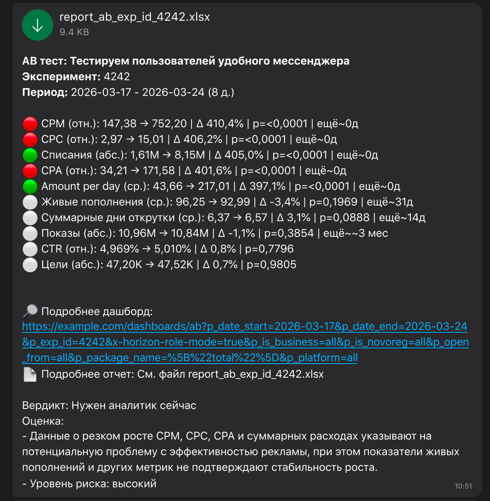
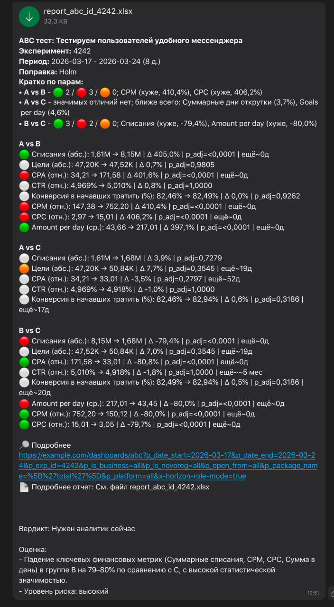
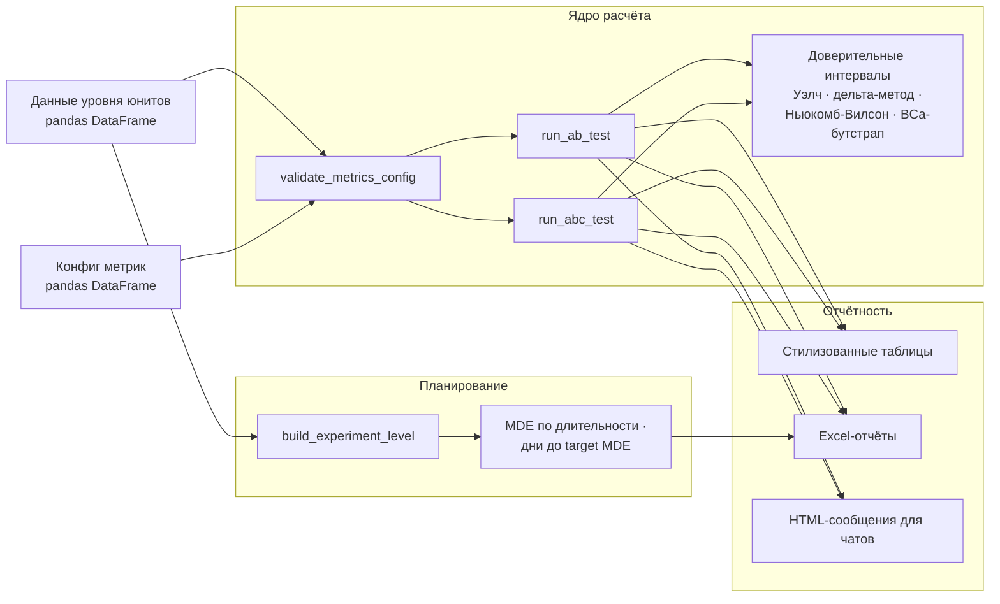

[English](README.md) | Русский

# fast_exp_analytics

**Python-библиотека для анализа A/B и A/B/C экспериментов: статистика, доверительные интервалы, планирование MDE и длительности, Excel-отчёты и короткие саммари для чатов — всё под аналитический сценарий работы в Jupyter.**

<p align="center">
  <a href="https://pypi.org/project/fast-exp-analytics/"></a>
  
  <a href="https://github.com/klipbn/fast_exp_analytics/actions/workflows/ci.yml"></a>
  <a href="https://github.com/klipbn/fast_exp_analytics/blob/main/LICENSE"></a>
  
</p>

## О проекте

Продуктовые аналитики раз за разом повторяют один и тот же цикл: выгрузить данные на уровне юнитов, договориться, как считается каждая метрика, проверить значимость, собрать отчёт и написать саммари для заказчика. Обычно это выливается в стопку одноразовых ноутбуков, где каждый тест посчитан чуть по-своему.

`fast_exp_analytics` превращает этот цикл в короткий повторяемый пайплайн:

1. Данные приносит сам аналитик — обычный `pandas.DataFrame` на уровне юнитов (SQL, ClickHouse, CSV — загрузка остаётся за пределами библиотеки).
2. Метрики один раз описываются конфигом: название, тип (`additive` / `average` / `ratio` / `share` / `median`), числитель, знаменатель и направление, которое считается улучшением.
3. Запускается A/B или A/B/C расчёт: p-value, доверительные интервалы, MDE, достигнутая мощность и оценка оставшейся длительности теста по каждой метрике.
4. Результат оформляется: стилизованная таблица в ноутбуке, Excel-отчёт и короткое HTML-сообщение для командного чата.

Один и тот же конфиг метрик обслуживает всё — статистику, таблицы, экспорты и сообщения, поэтому расчёт всегда выполняется одинаково.

## Возможности

- **Пять типов метрик со статистикой под каждую** — тест Уэлча для аддитивных и средних, линеаризация для ratio-метрик (CTR, CPA, CPM), z-тест для долей, Манна–Уитни для медиан.
- **Доверительные интервалы для всех типов метрик** — интервал Уэлча, дельта-метод для ratio, Ньюкомб–Вилсон для долей (корректен на 0%/100%), воспроизводимый BCa-бутстрап для медиан.
- **A/B/C из коробки** — все парные сравнения с поправкой Холма и одновременными (Бонферрони) доверительными интервалами.
- **Решение по каждой метрике** — MDE, достигнутая мощность, требуемый размер выборки и оценка, сколько ещё дней нужно тесту до значимости.
- **Планирование длительности эксперимента** — агрегация сырой дневной истории на любой уровень юнитов, MDE для запуска на 7/14/21/28+ дней или число дней до целевого MDE, включая неравные доли групп и сравнение чувствительности A/B против A/B/C.
- **Встроенная презентация результатов** — стилизованные таблицы, многостраничные Excel-отчёты с условным форматированием, HTML-сообщения с иконками вердиктов и приоритизацией ключевых метрик.
- **Опциональные интеграции без захардкоженной инфраструктуры** — отправка результатов в чат и LLM-ревью через явные конфиг-объекты (OpenAI-совместимый API).
- **Типизированная, протестированная и вылизанная** — `py.typed`, pytest-тесты покрывают статистику сквозным прогоном, ruff без замечаний, CI на Python 3.10–3.12.

## Демо

Саммари экспериментов для чатов (отрендеренный HTML, который формирует библиотека):

<table align="center">
  <tr>
    <td align="center">
      
      <br><sub>A/B-тест</sub>
    </td>
    <td align="center">
      
      <br><sub>A/B/C-тест</sub>
    </td>
  </tr>
</table>

В репозитории также лежит полный пример-ноутбук и сгенерированные отчёты:

| Файл | Описание |
|---|---|
| [`examples/fast_exp_analytics_example.ipynb`](examples/fast_exp_analytics_example.ipynb) | Полный сценарий: A/B, A/B/C, сообщения в чат, Excel-экспорт, MDE и планирование длительности |
| [`examples/report_ab_exp_id_4242.xlsx`](examples/report_ab_exp_id_4242.xlsx) | Пример Excel-отчёта A/B |
| [`examples/report_abc_id_4242.xlsx`](examples/report_abc_id_4242.xlsx) | Пример Excel-отчёта A/B/C |
| [`examples/duration_plan_ab.xlsx`](examples/duration_plan_ab.xlsx) | Пример отчёта планирования длительности |

## Установка

```bash
pip install fast-exp-analytics
```

Из исходников:

```bash
git clone https://github.com/klipbn/fast_exp_analytics.git
cd fast_exp_analytics
python -m venv .venv && source .venv/bin/activate
pip install -e .
```

Для разработки (тесты, линтер, ноутбук):

```bash
pip install -e ".[dev]"
```

## Быстрый старт

Полный проход на синтетических данных — этот код выполняется как есть:

```python
import pandas as pd
from fast_exp_analytics import make_synthetic_abc_dataset, run_ab_test, style_table_ab

# 1. Данные на уровне юнитов (здесь синтетика; в реальности — ваш SQL/CSV-пайплайн)
df = make_synthetic_abc_dataset(n=100_000, seed=42)
df_ab = df[df["exp_group"] != "C"]

# 2. Описываем метрики, которые сравниваем
metrics_df = pd.DataFrame.from_dict(
    {
        "shows":  ["Показы", "additive", "shows",  "shows",  "positive"],
        "ctr":    ["CTR",    "ratio",    "clicks", "shows",  "positive"],
        "amount": ["Списания", "additive", "amount", "amount", "positive"],
        "cpa":    ["CPA",    "ratio",    "amount", "goals",  "negative"],
        "cr":     ["Конверсия в создавших кампанию", "share", "is_create_ad", "is_in_exp", "positive"],
    },
    orient="index",
    columns=["desc", "type", "num", "den", "direction"],
)

# 3. Запускаем расчёт
result = run_ab_test(
    df=df_ab,
    metrics_df=metrics_df,
    exp_start_date="2026-03-17",
    exp_end_date="2026-03-24",
    group_base="A",
    group_exp="B",
)

# 4. Смотрим стилизованную таблицу в ноутбуке
style_table_ab(result, comment="Демо-эксперимент", experiment_id=4242)
```

## Использование

### A/B-тесты

```python
from fast_exp_analytics import (
    build_ab_chat_message,
    build_dashboard_url_ab,
    export_ab_results_to_excel,
)

# Стилизованный Excel-отчёт
export_ab_results_to_excel(
    df_result_ab=result,
    output_path="report_ab.xlsx",
    experiment_desc="Демо-эксперимент",
    exp_id=4242,
    date_from="2026-03-17",
    date_to="2026-03-24",
)

# Короткое HTML-сообщение для командного чата
msg = build_ab_chat_message(
    df_result=result,
    experiment_desc="Демо-эксперимент",
    exp_id=4242,
    date_from="2026-03-17",
    date_to="2026-03-24",
    dashboard_url="https://example.com/dashboard",
)
print(msg)
```

Контракт входных данных: в `df` для `run_ab_test` должны быть колонки `user_id`, `exp_group` и все колонки `num`/`den` из `metrics_df`. Отсутствующие колонки дают понятный `ValueError`.

<details>
<summary><strong>A/B/C-тесты (несколько групп)</strong></summary>

```python
from fast_exp_analytics import (
    build_abc_chat_message,
    export_abc_results_to_excel,
    run_abc_test,
    style_table_abc,
)

result_abc = run_abc_test(
    df=df,
    metrics_df=metrics_df,
    exp_start_date="2026-03-17",
    exp_end_date="2026-03-24",
    include_bc=True,                  # добавить сравнение B vs C
    pvalue_adjust_method="holm",      # поправка Холма по метрикам
)

style_table_abc(result_abc, caption="Демо-эксперимент: 2026-03-17 — 2026-03-24")

msg = build_abc_chat_message(
    df_result=result_abc,
    experiment_desc="Демо-эксперимент",
    exp_id=4242,
    date_from="2026-03-17",
    date_to="2026-03-24",
    dashboard_url="https://example.com/dashboard",
    use_adjusted=True,
)

export_abc_results_to_excel(result_abc, "report_abc.xlsx")
```

Каждая метрика сравнивается по парам (`A_vs_B`, `A_vs_C` и опционально `B_vs_C`). P-value корректируются методом Холма по каждой метрике, а доверительные интервалы расширяются до одновременных интервалов Бонферрони по числу сравниваемых пар.

</details>

<details>
<summary><strong>Планирование длительности эксперимента (MDE)</strong></summary>

```python
from fast_exp_analytics import (
    build_experiment_level,
    default_duration_metrics_config,
    duration_plan_summary,
    export_duration_results_to_excel,
)

# Агрегируем дневную историю на уровень юнита эксперимента
agg_df = build_experiment_level(
    df_raw,                 # дневные строки: user_id, date, amount, shows, clicks, main_goals
    unit_id_col="user_id",
    entity_id_col="campaign_id",
)

# MDE для разной длительности и число дней до целевого MDE
plan = duration_plan_summary(
    df_raw,
    unit_id_col="user_id",
    rollout_pct=0.5,                # доля трафика в эксперименте
    exp_days=[7, 14, 21, 28, 35],
    target_mde_pct=[5, 7, 10],
    experiment_type="ab",           # или "abc"; поддерживаются неравные group_shares
    metrics_config=default_duration_metrics_config(),
)

export_duration_results_to_excel(
    output_path="duration_plan.xlsx",
    mde_by_days_df=plan["mde_by_days"],
    days_for_target_mde_df=plan["days_for_target_mde"],
    experiment_name="Рекомендации бюджета",
    recommended_days=21,
)
```

В Excel-отчёт вместе с таблицами попадает лист с сводкой для менеджера. Свои метрики добавляются расширением конфига: `source_col` и опциональный трансформ `log1p`.

</details>

<details>
<summary><strong>Опциональные интеграции: чат и LLM-ревью</strong></summary>

```python
import os
from fast_exp_analytics import ChatSendConfig, OpenAICompatConfig, build_llm_review, send_chat_message

# Универсальный чат-API (токен передаётся явно, ничего не хардкодится)
chat_config = ChatSendConfig(api_base_url="https://chat-api.example.com/bot/v1", token=os.environ["CHAT_BOT_TOKEN"])
send_chat_message(config=chat_config, message=msg, chat_id="my-chat-id", file_path="report_ab.xlsx")

# LLM-ревью через любой OpenAI-совместимый эндпоинт
llm_config = OpenAICompatConfig(
    api_key=os.environ["OPENAI_API_KEY"],
    base_url="https://api.openai.com/v1",
    model="gpt-4o-mini",
)
review = build_llm_review(config=llm_config, system_prompt="Ты — аналитик A/B-тестов.", user_prompt=msg)
```

Обе интеграции требуют, чтобы пакеты и креденшелы предоставил вызывающий код; ядро библиотеки не зависит ни от какой инфраструктуры.

</details>

## Архитектура



- **`config.py`** — валидация конфига метрик (допустимые типы, направления, уникальность имён) и дефолтный набор метрик.
- **`ab.py` / `abc.py`** — статистическое ядро: подготовка данных по типу метрики, тесты, расчёт MDE/мощности/размера выборки, итоговые таблицы. В A/B/C добавляются парные сравнения и поправка на множественные сравнения.
- **`confidence_intervals.py`** — единая реализация доверительных интервалов для обоих движков.
- **`reporting*.py`** — чистое форматирование: таблицы, сборка ссылок на дашборды, HTML-сообщения с логикой иконок и ключевых метрик.
- **`exporters*.py`** — рендеринг Excel (openpyxl): стили, форматы чисел, условное форматирование, листы-сводки.
- **`duration.py`** — агрегация истории и оценки MDE/длительности на тех же z-статистиках.
- **`llm.py` / `messaging.py`** — опциональные интеграции, изолированные за явными конфиг-объектами.

## Статистические методы

| Тип метрики | Точечная оценка | Тест на значимость | ДИ для разницы |
|---|---|---|---|
| `additive` | сумма по группе | t-тест Уэлча | интервал Уэлча |
| `average` | среднее по юниту | t-тест Уэлча | интервал Уэлча |
| `ratio` (CTR, CPA, …) | отношение сумм, линеаризация относительно контроля | t-тест Уэлча на линеаризованных значениях | дельта-метод через influence functions |
| `share` | доля «успехов» | z-тест для двух долей | Ньюкомб–Вилсон (корректен на 0% / 100%) |
| `median` | медиана по юниту | Манна–Уитни | BCa-бутстрап (фиксированный seed) |

MDE и размер выборки считаются по стандартной двухвыборочной формуле с гармоническим средним размеров групп; MDE для ratio-метрик выражается относительно среднего знаменателя контроля.

## Пример вывода

`result` из быстрого старта (выбранные колонки):

| metric_name | value_base | value_exp | rel_delta | p_value | result | ci_lower | ci_upper |
|---|---:|---:|---:|---:|---|---:|---:|
| Списания | 1 614 609 | 8 153 601 | +405,0% | <0,0001 | positive | 190,25 | 204,09 |
| CPA | 34,21 | 171,58 | +401,6% | <0,0001 | negative | 129,10 | 145,63 |
| CTR | 4,969% | 5,010% | +0,8% | 0,7796 | neutral | −0,0024 | 0,0032 |

`build_ab_chat_message` формирует (HTML, показано так, как выглядит в чате):

```text
🟢 Списания (абс.): 1,61M → 8,15M | Δ 405,0% | p=<0,0001
🔴 CPA (отн.): 34,21 → 171,58 | Δ 401,6% | p=<0,0001
⚪ CTR (отн.): 4,969% → 5,010% | Δ 0,8% | p=0,7796
```

Иконки кодируют вердикт: 🟢 значимое улучшение, 🔴 значимое ухудшение, 🟠 почти значимо или большой наблюдаемый эффект, ⚪ нейтрально.

## Структура проекта

```text
fast_exp_analytics/          # пакет библиотеки
├── ab.py                    # статистический движок A/B
├── abc.py                   # движок A/B/C: парные тесты + поправка на множественность
├── confidence_intervals.py  # методы доверительных интервалов для обоих движков
├── config.py                # валидация конфига метрик + дефолты
├── datasets.py              # генератор синтетических данных для демо и тестов
├── duration.py              # планирование длительности: агрегация, MDE, число дней
├── reporting.py             # сообщения A/B/C + ссылки на дашборды
├── reporting_ab.py          # сообщения A/B + ссылки на дашборды
├── exporters.py             # Excel-экспорт A/B/C
├── exporters_ab.py          # Excel-экспорт A/B
├── exporters_duration.py    # Excel-экспорт планирования длительности
├── llm.py                   # опциональное LLM-ревью (OpenAI-совместимый API)
└── messaging.py             # опциональная отправка в чат
examples/                    # пример-ноутбук, образцы отчётов, скриншоты
tests/                       # pytest-тесты
```

## Стек

| Область | Технология |
|---|---|
| Язык | Python 3.10+ |
| Данные / статистика | pandas, NumPy, SciPy, statsmodels |
| Отчётность | openpyxl (Excel), pandas Styler |
| HTTP-интеграции | requests, openai (опционально) |
| Тесты | pytest |
| Линтер | ruff |
| Сборка | setuptools, pyproject.toml |

## Конфигурация

Ядру библиотеки не нужны ни настройки, ни креденшелы. Опциональные интеграции из примера-ноутбука читают токены из переменных окружения:

| Переменная | Обязательна | Описание |
|---|---:|---|
| `CHAT_BOT_TOKEN` | Нет | Токен для `send_chat_message` (отправка в чат) |
| `OPENAI_API_KEY` | Нет | Ключ для `build_llm_review` (OpenAI-совместимый API) |

```bash
cp .env.example .env   # заполните только то, что используете
```

## Тесты

```bash
pytest
```

Тесты проверяют формулы доверительных интервалов против эталонных расчётов, все типы метрик сквозным прогоном через `run_ab_test` / `run_abc_test`, поведение поправок в A/B/C, раскладку колонок в Excel, валидацию конфигов, математику планирования длительности и форматирование сообщений.

## Разработка

```bash
ruff check fast_exp_analytics tests   # линтер
ruff format fast_exp_analytics tests  # форматирование (длина строки 100)
pytest                                # тесты
```

CI гоняет линтер и тесты на Python 3.10, 3.11 и 3.12.

## Инженерные решения

- **Один конфиг обслуживает всё.** Метрики описываются декларативно (`desc`, `type`, `num`, `den`, `direction`), и этот же конфиг используют статистическое ядро, таблицы, Excel-экспорты и сообщения. Добавить метрику — одна строка, а не пять правок.
- **Статистика подбирается под семантику метрики, а не один универсальный тест.** Ratio-метрики линеаризуются относительно контроля перед тестированием; доли получают интервалы Ньюкомба–Вилсона, корректные на граничных значениях; для медиан — засеянный BCa-бутстрап вместо нормальной аппроксимации. Корректность на границах была приоритетом (эволюция методов видна в `CHANGELOG.md`).
- **Загрузка данных остаётся за пределами библиотеки.** API принимает только датафреймы уровня юнитов, поэтому пакет работает с любым хранилищем и форматом и тестируется без инфраструктуры.
- **Интеграции явные, а не «из воздуха».** Отправка в чат и LLM принимают конфиг-объекты с креденшелами от вызывающего кода. В ядре нет эндпоинтов, чтения окружения и побочных эффектов.
- **Презентация результата — такой же продукт библиотеки, как и статистика.** На практике итог — сообщение, которое менеджер читает за 10 секунд; логика иконок, приоритизация ключевых метрик и подсказки «сколько ещё дней» — часть библиотеки, а не постобработка.

## Ограничения

- Колонка идентификатора юнита зафиксирована как `user_id`; другие ID требуют переименования перед анализом.
- Для медианных метрик считается p-value Манна–Уитни, но нет оценок MDE/мощности (возвращается NaN).
- Метрики-доли используют бинарную семантику успеха: любой `num > 0` считается успехом.
- Встроенные шаблоны сообщений и подписи дефолтных метрик ориентированы на русский язык; ключевые метрики переопределяются параметрами, но локализации шаблонов пока нет.
- Пока нет методов последовательного тестирования и снижения дисперсии (CUPED).
- Сравнения A/B/C парные между тремя группами (`A/B/C`); большее число групп потребует расширения кода.

## Roadmap

- [x] A/B и A/B/C анализ с поправкой на множественные сравнения
- [x] Доверительные интервалы для всех типов метрик
- [x] Планирование MDE и длительности
- [x] Отчёты Excel / ноутбук / чат
- [ ] Локализуемые шаблоны сообщений (английские дефолты)
- [ ] Настраиваемая колонка ID юнита
- [ ] CUPED / снижение дисперсии по предэкспериментальным данным

## Лицензия

[MIT](LICENSE) © 2026 Alexey Voronko
